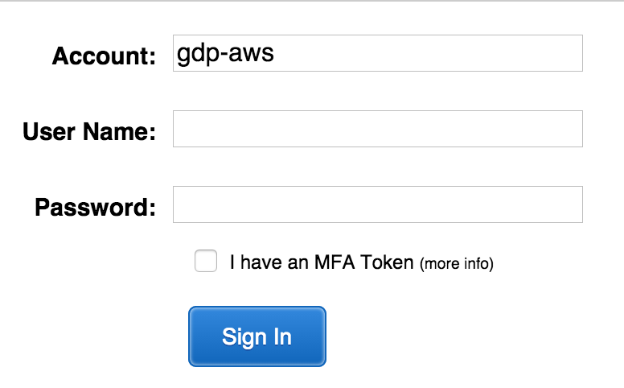
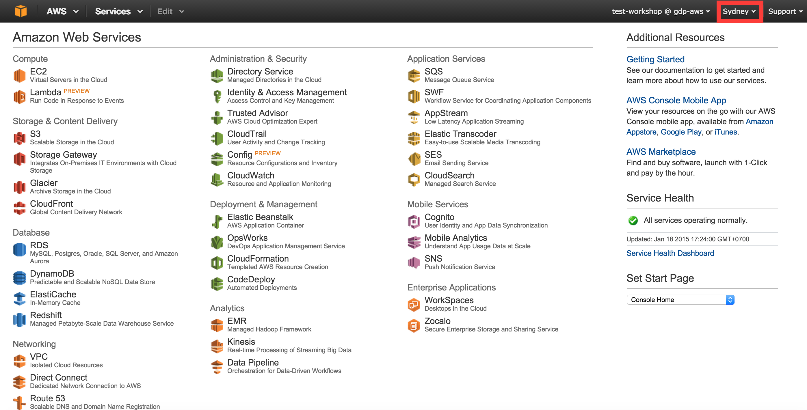
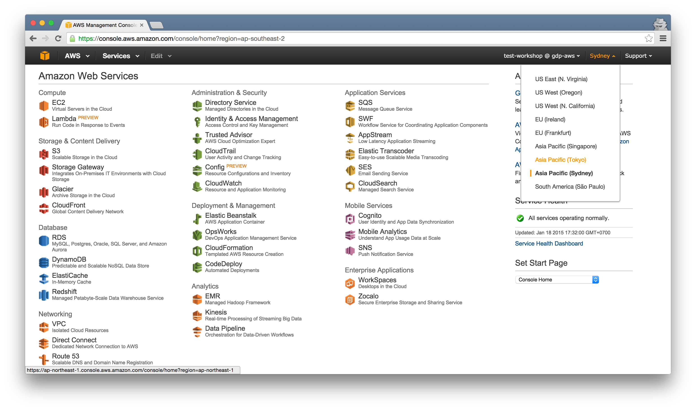
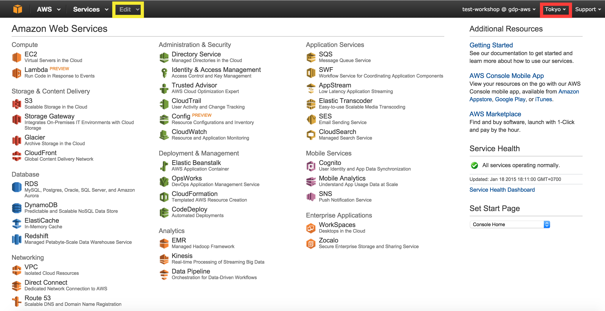
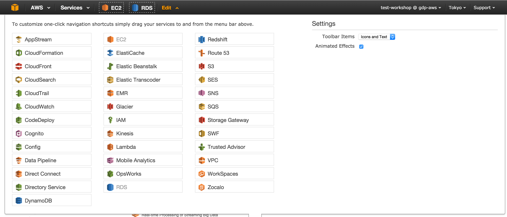

# AWS Management Console
AWS provide web based interface to interact with all services. This web interface can be accessed depended on https://console.aws.amazon.com/. Every account is given its own console url with the following format `https://[account name].signin.aws.amazon.com/console/`.

In this workshop, we are going to use GDP Labs's AWS account. Follow this guide to login to the console
1. Visit https://gdp-aws.signin.aws.amazon.com/console/
2. Enter **User Name**, **Password** and click **Sign In** 
3. You will be directed to AWS Console Home  The console show that we are accessing Sydney datacenter. Lets switch to Tokyo.
4. Click the Sydney field (red rectangle at the upper right section), and choose Tokyo  You will be directed to Tokyo datacenter 
5. Since we are going to work alot with EC2, and RDS, lets bookmark these services. To bookmark a service, click edit button and drag the service from listing to menu bar after services.
6. Bookmark EC2 and RDS as follow 
