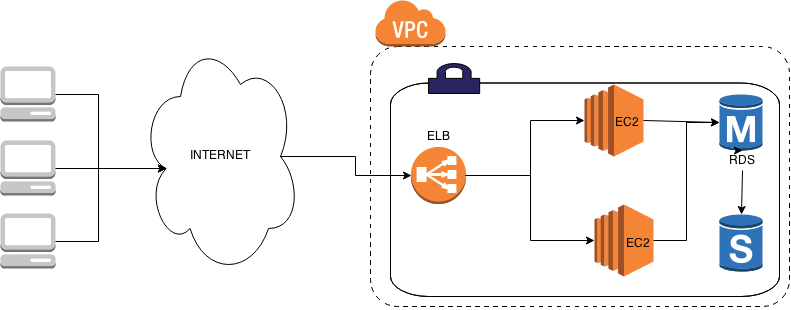

# Case Study: Fully HA Webapp Infrastructure
We are going to combine ELB, EC2, and RDS to form webapp infrastructure that has no single point of failure (SPOF). All components must be highly available such as ELB, EC2, and RDS. The final result will be as follow 
