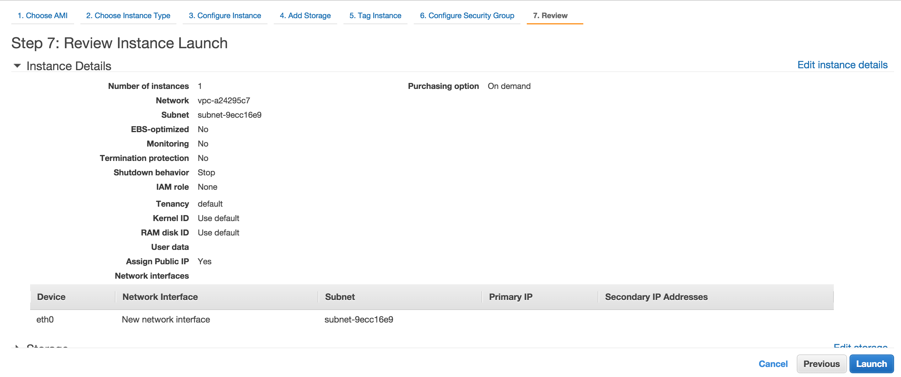

# Case Study: Fully HA Webapp Infrastructure
We are going to combine ELB, EC2, and RDS to form webapp infrastructure that has no single point of failure (SPOF). All components must be highly available such as ELB, EC2, and RDS. The final result will be as follow 

# Implementation Plan
We are going to reuse EC2, RDS, and ELB that have been created before. Make sure they are launched properly. Follow [launch EC2 instance](../launch_ec2_instance/README.html#launching-an-ec2-instance), [launch RDS instance](../launch_rds_instance/README.html#launching-an-rds-instance), and [launch ELB instance](../launch_elb_instance/README.html#launching-an-elb-instance) to launch EC2, RDS, and ELB respectively.

We are going to use laravel 5 sample application to test this infrastructure. To make deployment easier, we are using prebuild docker image at [https://registry.hub.docker.com/u/gdplabs/workshop-sample-laravel5/](https://registry.hub.docker.com/u/gdplabs/workshop-sample-laravel5/).

Here is what need to do:
1. Make new database and user at the RDS MySQL.
```SQL
create database homestead;
grant all on homestead.* to 'homestead'@'%' identified by 'secret';
flush privileges;
```
2. Install docker at the EC2 instance by following executing `wget -qO- https://get.docker.com/ | sh`
3. Stop nginx at the EC2 instance, `sudo service nginx stop`
4. Run docker containers on the EC2 instance, `sudo docker run --name workshop -d -e DB_HOST=127.0.0.1 -e DB_DATABASE=homestead -e DB_USERNAME=homestead -e DB_PASSWORD=secret -p 80:8000 gdplabs/workshop-sample-laravel5`. Don't forget to adjust value of database host, name, username, and password. To check whether it runs correctly, execute `docker ps`. 
5. Launch a second EC2 instance.
    1. At the **EC2 Dashboard** page, choose the first EC2 instance, click **Actions** > **Launch More Like This**. 
    2. At the **Review** page, click **Edit instance details**. 
    3. At the **Configure Instance** page, change **Subnet**. Make sure its value is complimentary subnet of the first instance. For example, if the first instance resides in _public-1a_, this instance must be put in _public-1c_ and the other way around. Click **Review and Launch**. 
    4. At the **Review** page, click **Launch**. 
    5. At the **Select an exiting key pair or create a new key pair** page, choose the appropriate key, and click **Launch Instances**. 
    6. At the **Launch Status** page, click **View Instances**.
6. Run step #2 and #4 inside the second EC2 instance.
7. Modify health check of the ELB from */index.html* to */*.
    1. At the **ELB Dashboard** page, choose ELB, and click Actions > Edit health check. 
    2. At the **Configure Health Check** page, set **Ping Path** to _/_ and click **Save**. 
8. Register the second EC2 instance to the ELB.
    1. At the **Instances** tab on **ELB Dashboard**, click **Edit Instances**. 
    2. At the **Add and Remove Instances** page, select EC2 instances, and click **Save**. 
9. Wait until status of ELB instances is *InService*. 
10. Access the app by using ELB Domain Name.
