# Amazon Elastic Compute Cloud (EC2)
AWS EC2 is a web service that provides resizeable compute capacity in the cloud. It is designed to make web-scale cloud computing easier for developers. It comes with preconfigured RAM, CPU, and network capacity.
[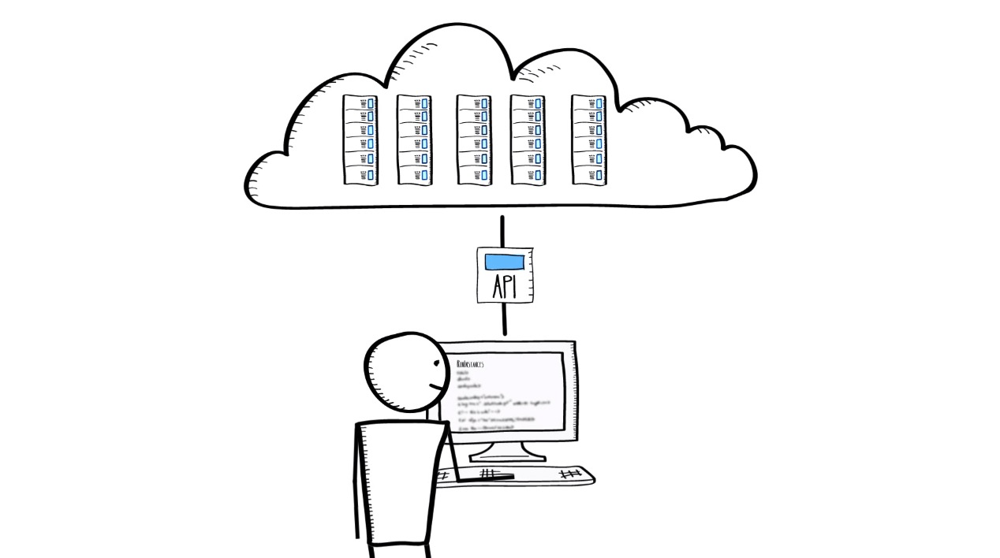](./Introduction to Amazon EC2.mp4)

# Launching an EC2 instance
1. Visit EC2 instances dashboard at [https://ap-northeast-1.console.aws.amazon.com/ec2/v2/home?region=ap-northeast-1#Instances:sort=instanceId](https://sites.google.com/a/kaskusnetworks.com/kaspay-project/infra-s-guide/kaspay-escrow-aws-architecture-using-ansible)
2. At the EC2 instance dashboard, click **Launch Instance**. 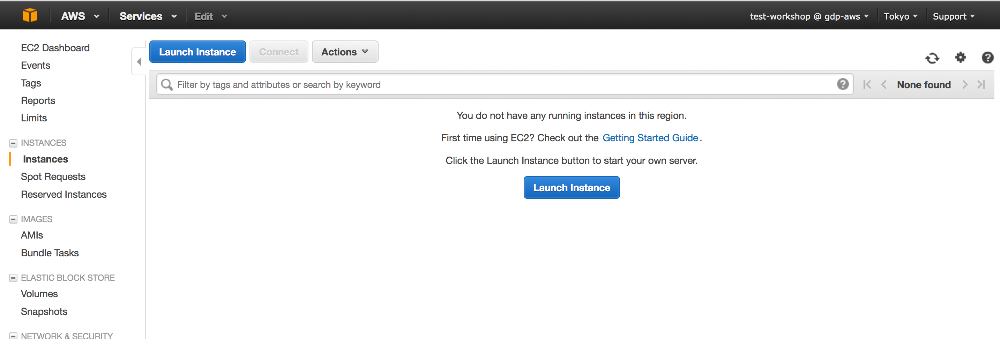
3. At the **Choose AMI** page, choose appropriate AMI. Available options are **Quick Start** which is managed by Amazon, **My AMIs** which is created by our users, **AWS Marketplace** where AMIs are provided by trusted vendors, and **Community AMIs** which is provided by community. Lets choose **Ubuntu Server 14.04 LTS (HVM), SSD Volume Type** from **Quick Start** by clicking **Select** after this entry. 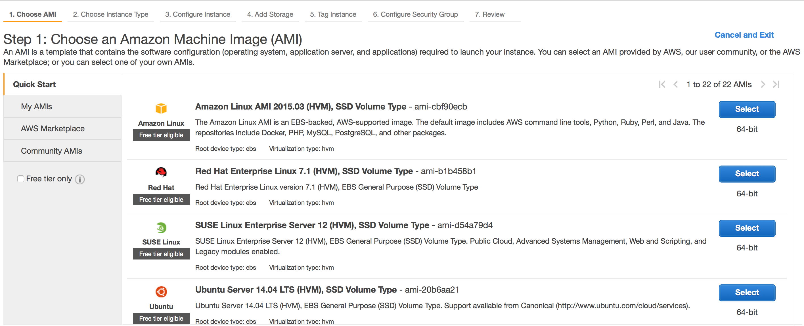
4. At the **Choose Instance Type** page, select *t2.micro* under **Type**, and click **Next: Configure Instance Details**. 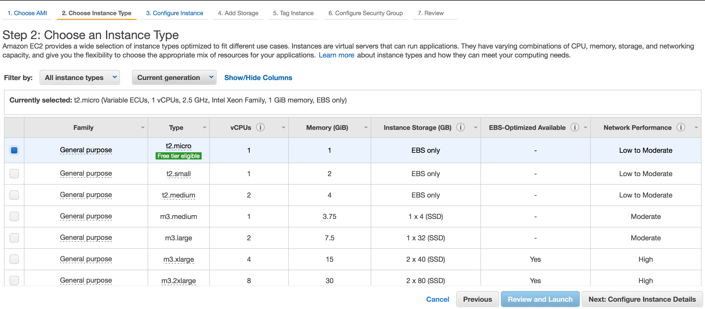
5. At the **Configure Instance** page, select *workshop* at **Network** options, select *public-1a* at **Subnet** options, and leave the rest fields as is. Click **Next: Add Storage**. 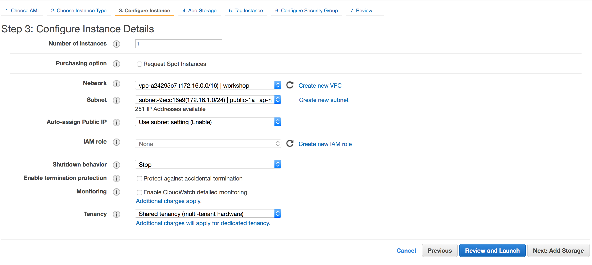
6. At the Add Storage**** page, fill **Size (GiB)** with size of root disk of the instance (fill 8 for this particular example), choose *General Purpose (SSD)* under **Volume Type**, tick **Delete on Termination** to terminate EBS volume along with this instance termination. Click **Next: Tag Instance**. 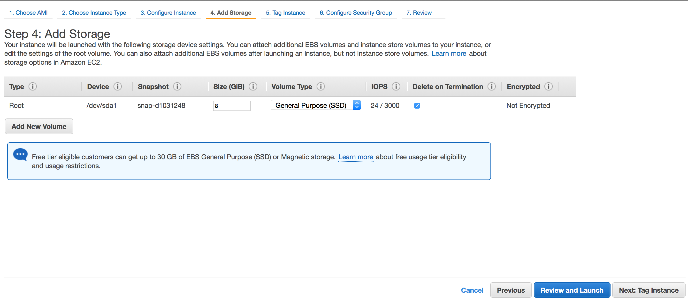
7. At the **Tag Instance** page, we can add up to 10 tags (key value pair). This tag will be used to identify and group instances, especially tag with Key name will be used to display name of this instance. Upon finished, click **Configure: Security Group**. 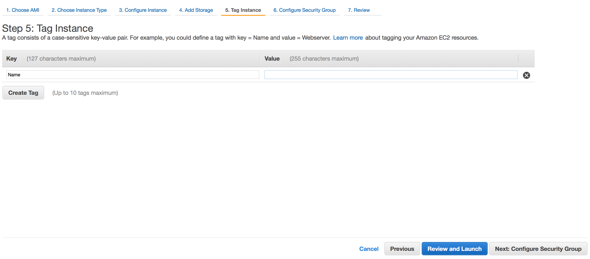
8. At the **Configure Security Group** page, choose appropriate security group. We can choose preconfigured security groups or generate a new one. Upon finished, click Review and Launch. 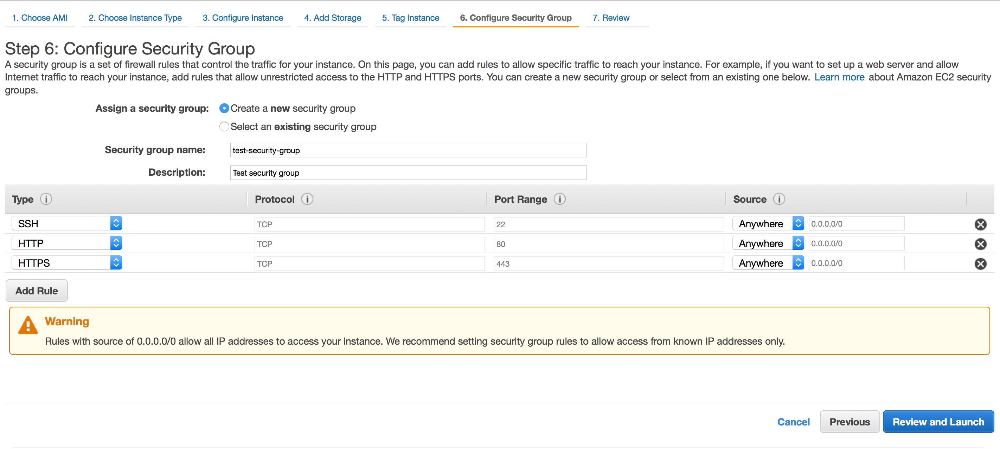
9. At the **Review** page, review this instance properties and click **Launch**. 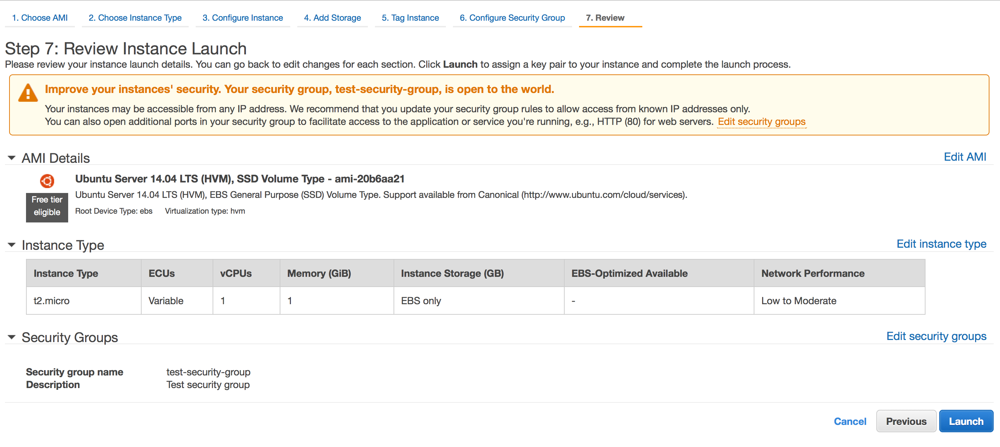
10. At the **Select and existing key pair or create a new key pair** page, select *Create a new key* pair, fill **Key pair name**, click **Download Key Pair** (save key pair locally), and click **Launch Instance**. 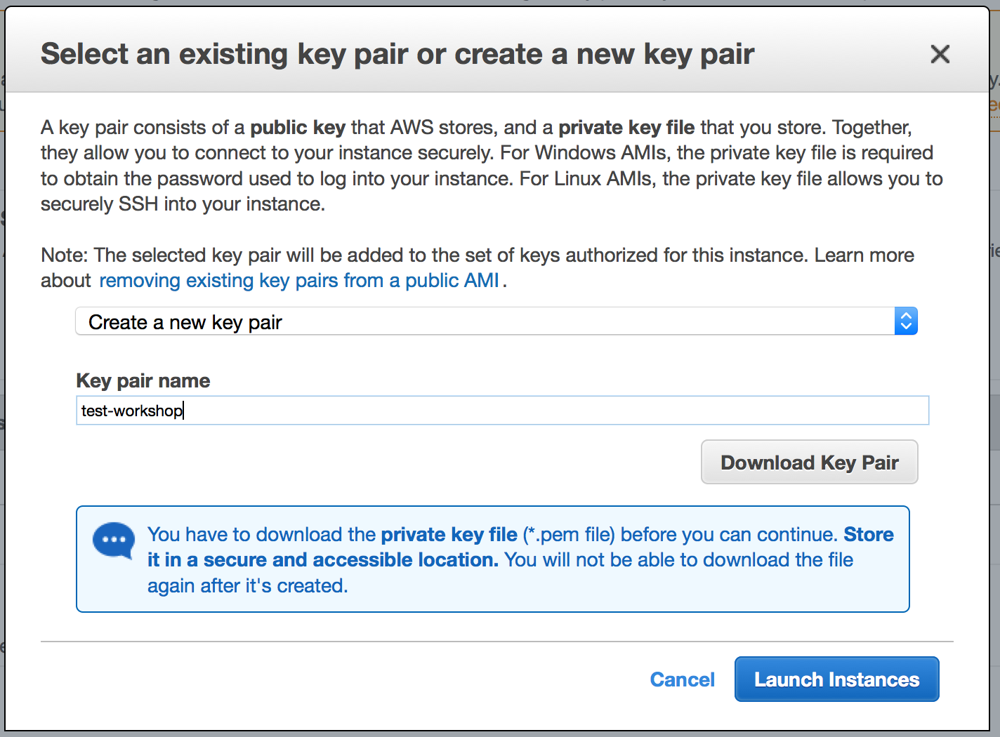
11. At the **Launch Status** page, click **View Instance**  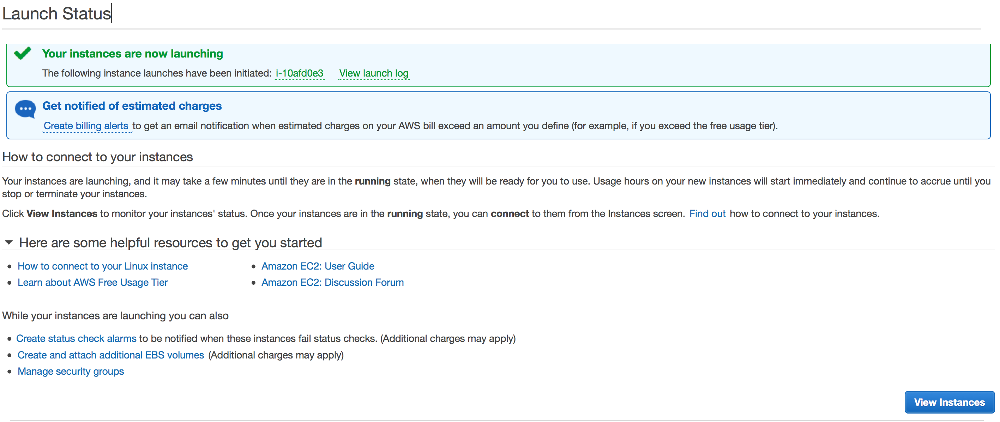 to see the newly create EC2 instance as follow 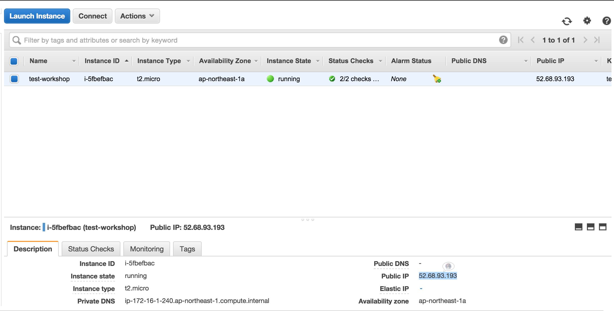
12. Copy instance public ip. This will be needed to access this instance via ssh.

# Accessing EC2 Instance using SSH
1. Make sure ssh client has been installed (openssh, putty, cygwin, or git bash)
2. Using openssh client or the like. Assuming the key is located at ~/Downloads/test-workshop.pem.
  1. Make sure the key has appropriate permission, `chmod 400 ~/Downloads/test-workshop.pem`.
  2. Execute `ssh -i <key path> <username>@<server public ip>``. For example, `ssh -i ~/Downloads/test-workshop.pem ubuntu@52.68.93.193`.
3. Using Putty
  1. Download [PuTTy.exe](http://the.earth.li/~sgtatham/putty/latest/x86/putty.exe)
  2. Run PuTTy.exe
  3. Convert private key from pem format to putty.
    1. Download [PuTTyGen.exe](http://the.earth.li/~sgtatham/putty/latest/x86/puttygen.exe)
    2. Run puttygen.exe.
    3. Click **Load** to browse private key. Select private key and puttygen will show successful notice, and click **OK**.
    4. Private key has been converted and save it by clicking **Save private key**.
    5. [Optional] Make the private key safer by insert passphrase on **Key passphrase** and **Confirm passphrase**. If passphrase is not inserted, putty will ask confirmation before saving it.
    6. Click **Save private key** to save the key to local disk.
  4. Fill Host Name or (IP address) with EC2 instance public ip. 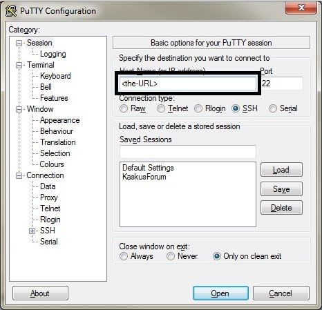
  5. [Optional] Insert session name on **Saved Sessions** and click **Save**. This features comes in handy to reconnect in the future.
  6. Choose plus sign next to **SSH** on left side menu and **Auth**.
  7. Browse private key file by clicking **Browse** under **Private key file for authentication**. 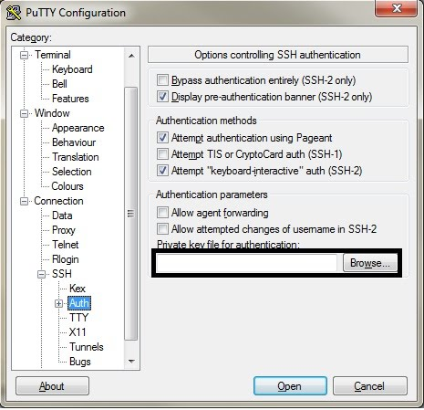
  8. Click **Open**.
  9. Congratulation! Now we are connected to your instance. Type **login as:** _ubuntu_ (Since we are using Ubuntu AMI).

# Accessing EC2 Instance using web browser
We are going to host static page in this instance.
1. Install nginx, `sudo apt-get update && sudo apt-get install -y nginx`
2. Open web browser and visit this instance public ip.
