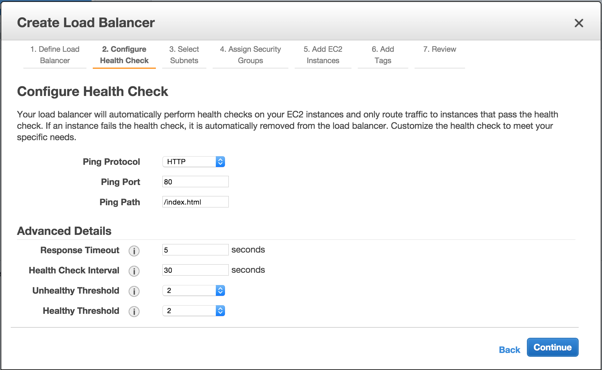

# Amazon Elastic Load Balancing (ELB)
Elastic Load Balancing automatically distributes incoming application traffic across multiple Amazon EC2 instances in the cloud. It enables you to achieve greater levels of fault tolerance in your applications, seamlessly providing the required amount of load balancing capacity needed to distribute application traffic. 

# Launching an ELB instance
1. Visit **ELB Dashboard** at https://ap-northeast-1.console.aws.amazon.com/ec2/v2/home?region=ap-northeast-1#LoadBalancers:
2. At the **ELB Dashboard** page, click Create Load Balancer. 
3. At the **Define Load Balancer** page, fill **Load Balancer name**, choose _workshop_ for **Create LB Inside**, and click **Continue**. 
4. At the **Configure Health Check** page, leave as is and click **Continue**. 
5. At the **Select Subnets** page, choose _public-1a_ and _public-1c_ under **Name**, and click **Continue**. 
6. At the **Assign Security Groups** page, choose _Select an existing security group_ for **Assign a security group**, select _public-web_ under **Name**, and click **Continue**. 
7. At the **Add EC2 Instances** page, choose EC2 instances that will be registered to this ELB, and click **Continue**. 
8. At the **Add Tags** page, fill appropriate tags (under **Key** and **Value**), and click **Continue**. 
9. At the **Review** page, click **Create**. 
10. At the Create Load Balancer page, click Close. 
11. The newly created ELB will be shown at the **ELB Dashboard**. 
12. Navigate to **Instances** tab and wait until EC2 instance ready to accept traffic from load balancer (Indicated by _InService_ under **Status**). 
13. Visit ELB **DNS Name** under **Description** tab using web browser.
