# Amazon Relational Database Services (RDS)
Amazon Relational Database Service (Amazon RDS) is a web service that makes it easy to set up, operate, and scale a relational database in the cloud. It provides cost-efficient and resizable capacity while managing time-consuming database management tasks, freeing you up to focus on your applications and business.
[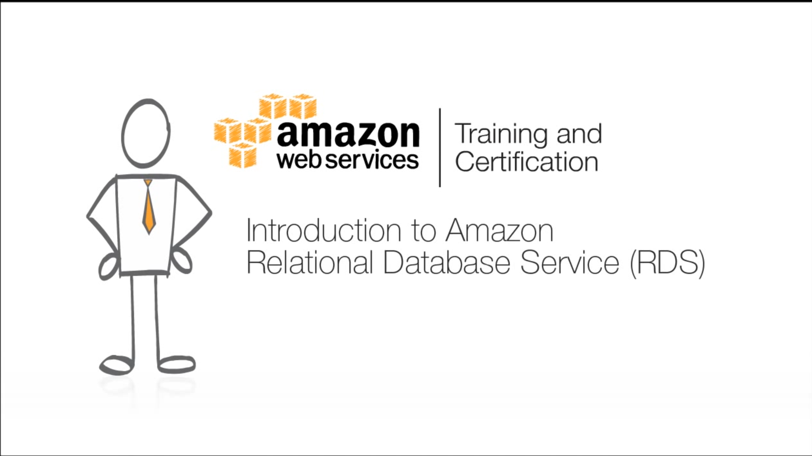](./Introduction to Amazon RDS.mp4)

# Launching an RDS instance
1. Visit RDS Dashboard at https://ap-northeast-1.console.aws.amazon.com/rds/home?region=ap-northeast-1#dbinstances:
2. At the **RDS Dashboard** page, click **Launch DB Instance**. 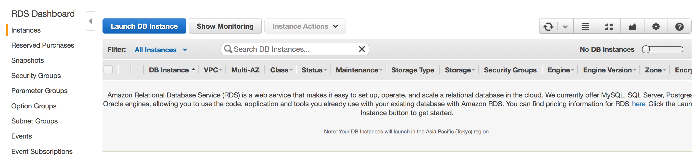
3. At the **Select Engine** page, choose _MySQL_ and click **Select**. 
4. At the **Production?** page, choose **Yes, use Multi-AZ Deployment and Provisioned IOPS Storage as defaults while creating this instance** and click Next Step. 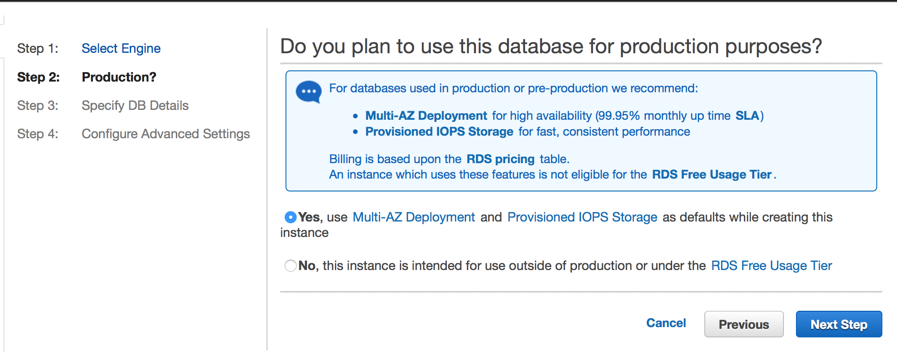
5. At the **Specify DB Details** page section **Instance Specticiation**, choose **DB Engine Version** *latest*, **DB Instance Class** *db.t2.micro*, **Multi-AZ Deployment** *Yes*, **Storage Type** *Magnetic* (It is not recommended to use SSD for storage under 100 GB), **Allocated Storage** *5*. 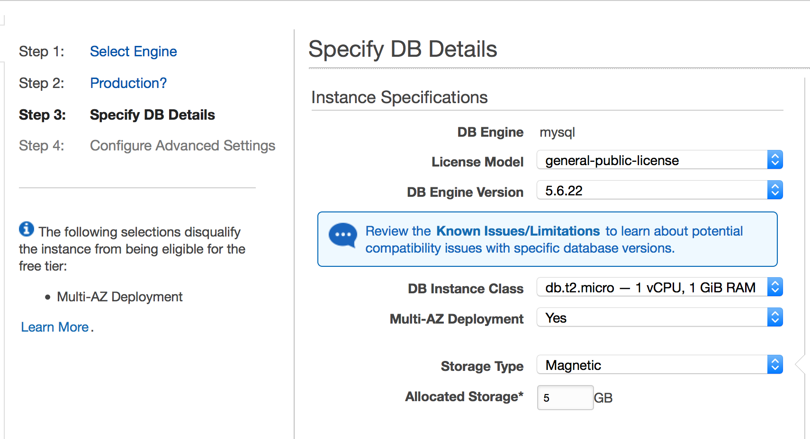 At section **Settings**, fill **DB Instance Identifier**, **Master Username**, **Master Password**, and **Confirm Password** appropriately. Upon finished, click **Next Step**. 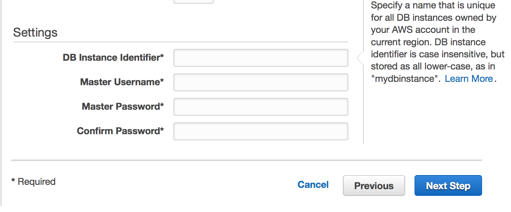
6. At the **Configure Advanced Settings** page section **Network & Security**, choose **VPC** *workshop*, **Subnet Group** *rds-workshop*, **Publicly Accesible** *No*, and **VPC Security Group(s)** *internal-mysql (VPC)*. 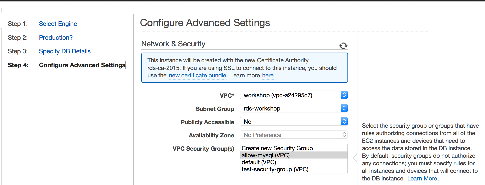 At section **Database Options**, fill **Database Name** and leave other as is. 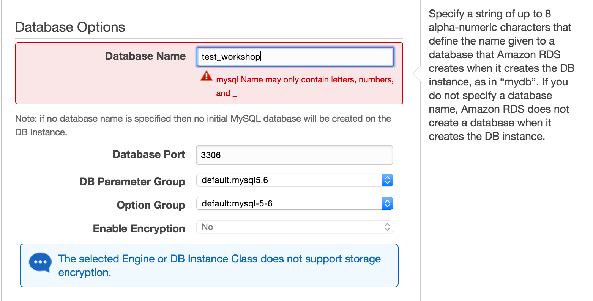 At section **Backup**, select _7_ for **Backup Retention Period**, choose _Select Window_ for **Maintenance Window**, and set _20:00_ for **Start Time** and _0.5_ for **Duration**. At section **Maintenance**, select _Yes_ for **Auto Minor Version Upgrade**, choose _Select Window_ for **Maintenance Window**, set _Sunday_ for **Start Day**, set _21:00_ for **Start Time**, and _0.5_ for **Duration**. 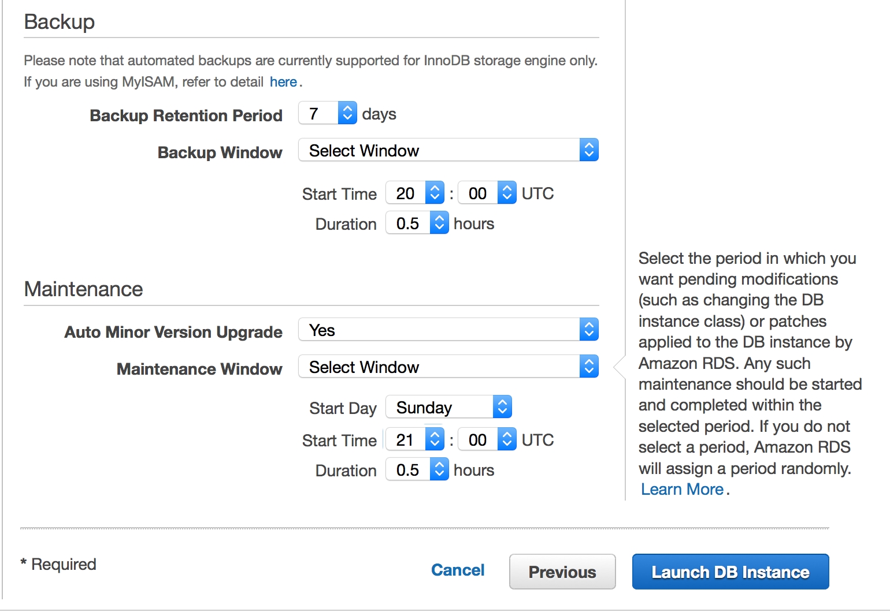
7. At the **Connecting to your DB Instance** page, click **View Your DB Instances**. 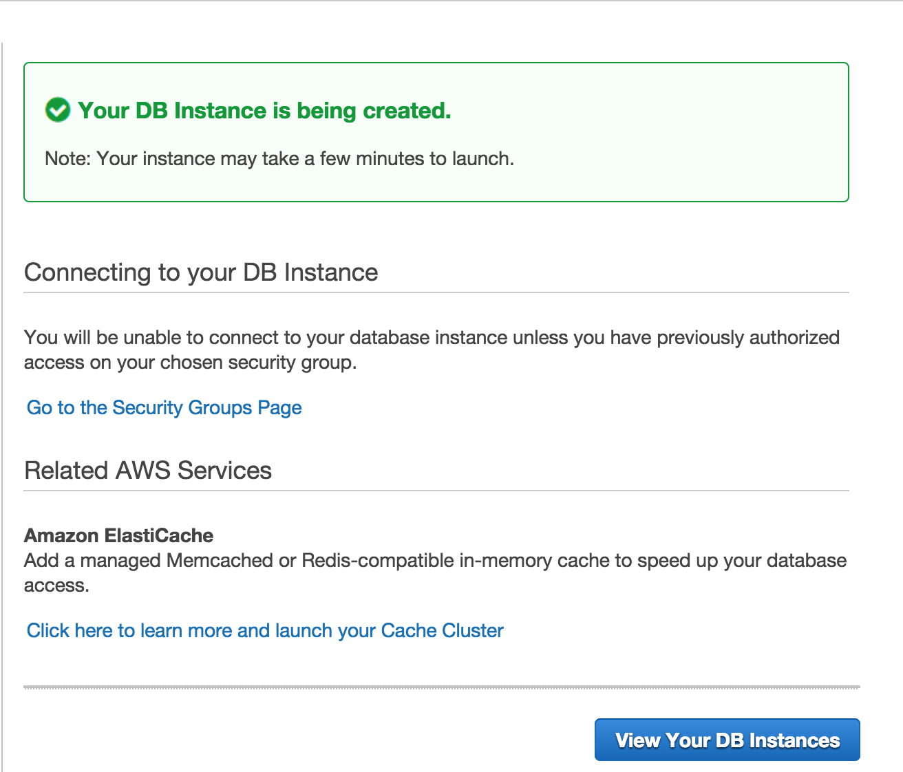
8. We will be brought to the **RDS Dashboard** page where we can view the RDS instance. It will take around 15 minutes for the instance to be available 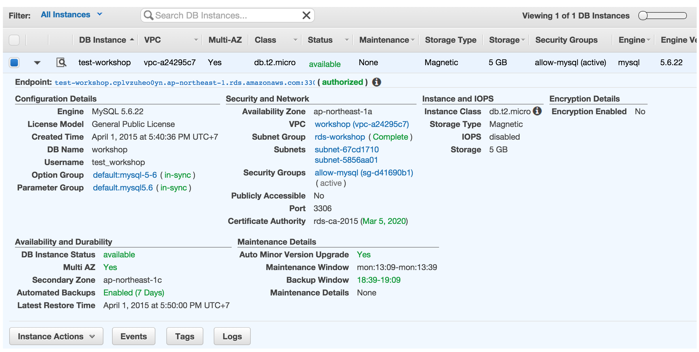

# Connecting to RDS MySQL from EC2
Assuming EC2 instance has been launched and follow this guidance
1. SSH to the EC2 instance.
2. Install mysql client, `sudo apt-get install -y mysql-client-5.6`.
3. Connect to the RDS MySQL by issuing, mysql -h&lt;RDS Hostname&gt; -u&lt;RDS Username&gt; -p. For example, `mysql -htest-workshop.cplvzuheo0yn.ap-northeast-1.rds.amazonaws.com -utest_workshop -p`. 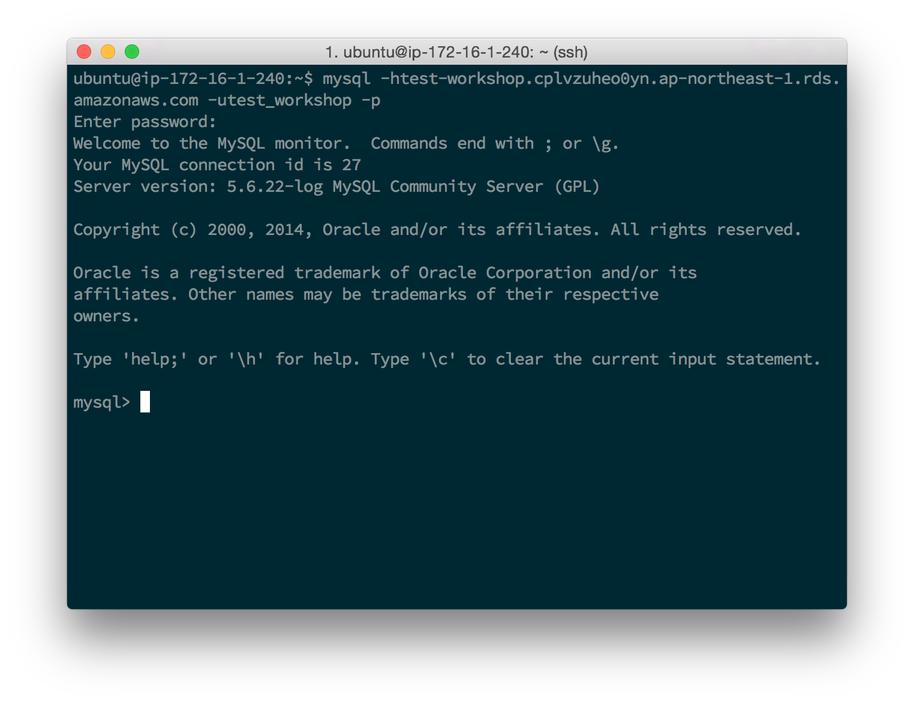
